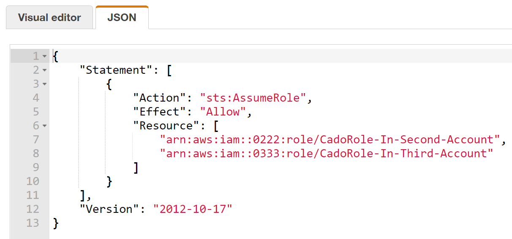

# Terraform Script to Update Cado Response Cross Account Policy #

This is an example terraform script that can be used to programmatically add to the list of cross-account roles that Cado Response can import from.

If you want to add access to a new account from Cado Response:

1. Create a role with required access in the new account (see documentation)
2. Use this script (or manually) to update the Cado Response Policy (*CadoResponseCrossAccountPolicy*) which records the names of the roles in other accounts that Cado Response can use to import cross-account

#### To Execute ####

* To create the *CadoResponseCrossAccountPolicy* run *terraform apply*
* To update the list of cross account roles in the *CadoResponseCrossAccountPolicy* - update the roles listed in policy.tf then run *terraform apply*

If you would prefer to list new policies on the command line, you can do so [by using command line variables](https://stackoverflow.com/questions/62087332/terraform-and-aws-modify-an-existing-policy). If you are not using Terraform, you can also achieve similar automated functionality using a [Python script](https://stackoverflow.com/questions/50935599/how-to-update-iam-policy-using-boto3-python).

#### Background ####
Under the hood - Cado Response will look for a policy in it’s account called *CadoResponseCrossAccountPolicy*.

It will then read out the list of roles it can assume, and populate the user interface with this list of roles.

For example:

Would then show these as options for importing from other accounts:

* CadoRole-In-Second-Account
* CadoRole-In-Third-Account

These roles will need to have the required access, for example they will need to be able to snapshot EC2 volumes to be able to import them cross-account.

